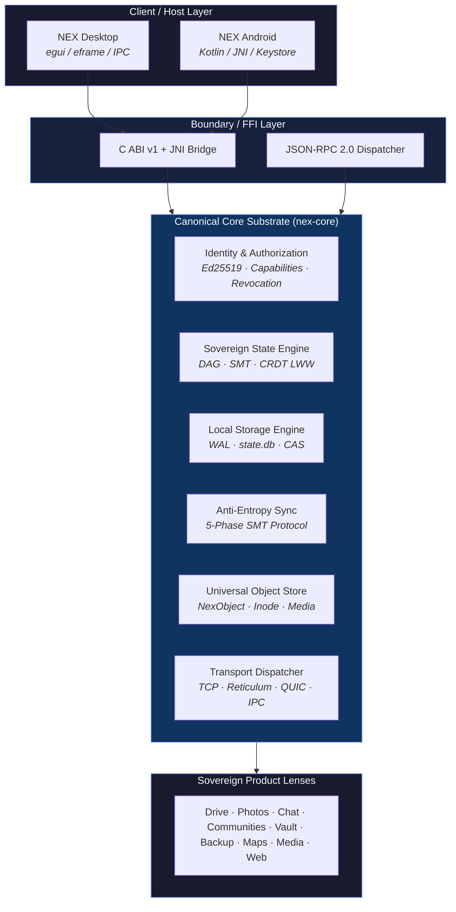

<p align="center">
  
</p>

<h3 align="center">Sovereign connections.</h3>

<p align="center">
  A local-first, peer-to-peer personal computing platform that replaces the corporate cloud with an autonomous, user-owned sovereignty substrate.
</p>

<p align="center">
  
  
  
  
  
</p>

---

## Why NEX?

Modern digital life is trapped in centralized corporate clouds where users do not own their identity, data, communication, or compute. NEX replaces the corporate cloud model with a **sovereign, local-first, peer-to-peer substrate** upon which a complete ecosystem of daily computing applications is built.

> **Your data lives on your devices. Your identity is your cryptographic key pair. Your relationships are private cryptographic enclaves. No corporation can revoke, surveil, or monetize any of it.**

### Highlights

| | Feature | Description |
|---|---|---|
| 🔐 | **Sovereign Identity** | Ed25519 key pairs with capability-based security — no corporate identity provider required |
| 📡 | **Mesh Synchronization** | 5-phase anti-entropy protocol with Sparse Merkle Tree reconciliation across all your devices |
| 💾 | **Local-First Storage** | Append-only WAL, two-phase checkpointing, and content-addressed FastCDC chunked storage |
| 🛡️ | **Capability Security** | Zero ambient authority — every action requires a cryptographically signed capability token |
| 🌐 | **Transport Agnostic** | TCP, WebRTC, Reticulum mesh radio, IPC — same protocol over any conduit |
| 🖥️ | **Cross-Platform** | Native desktop (egui/eframe), Android (Kotlin/JNI), with shared Rust core substrate |

---

## Architecture



---

## Product Ecosystem

NEX organizes its capabilities into **15 coherent product families**. The sovereign substrate handles the complexity; users experience seamless, integrated products.

| Product | Purpose | Key Capabilities |
|---|---|---|
| **NEX Home** | Personal sovereign dashboard | Launcher, notifications, device health, global search |
| **NEX Drive** | File sovereignty | Local-first folders, CAS deduplication, P2P sharing |
| **NEX Photos** | Visual memory protection | On-device ML search, EXIF indexing, full-res family sharing |
| **NEX Comms** | Sovereign communication | E2EE chat, P2P voice/video, mail, contacts web-of-trust |
| **NEX Maps** | Private navigation | Offline vector tiles, GPS tracks, shared waypoints |
| **NEX Media** | Home media streaming | Music/video server, transcoding, device casting |
| **NEX Vault** | Zero-knowledge secrets | Hardware keystore credentials, private documents |
| **NEX Backup** | Disaster recovery | SMT snapshots, cross-device replication, time-machine |
| **NEX Productivity** | Sovereign work suite | Tasks, calendar, notes, office, projects |
| **NEX AI** | Private intelligence | Local LLM inference, capability-secured agents |
| **NEX Automation** | IoT orchestration | Smart home, sensor monitoring, event-driven workflows |
| **NEX Web** | Internet bridge | Local HTTP gateway, WebRTC bridge, sandboxed apps |
| **NEX Applications** | App ecosystem | Discovery, sandboxed install, capability approval |
| **NEX Developer** | Tooling & SDKs | Multi-language SDKs, simulation testbeds, WASM compiler |
| **NEX Economics** | Sovereign commerce | Payment-rail agnostic, resource contribution markets |

---

## Quick Start

### Prerequisites

- [Rust](https://rustup.rs/) (stable, 2021 edition)
- Platform build tools (Visual Studio Build Tools on Windows, `build-essential` on Linux)

### Build

```bash
# Clone the repository
git clone https://github.com/Zerokool1986/Nex.git
cd Nex

# Build the entire workspace
cargo build --workspace

# Run the desktop application
cargo run -p nex-desktop

# Run all tests
cargo test --workspace
```

### Test Suites

The project includes **700+ tests** organized across the sovereignty substrate:

| Suite | Coverage | Evidence Level |
|---|---|---|
| Causal State DAG & Lamport Clocks | Chaos-verified (L6) | `r50_1`, `r50_6`, `conformance_tests` |
| Sparse Merkle Tree | Chaos-verified (L6) | `r50_1`, `r71_17` |
| Write-Ahead Log (NEX/WAL/v1) | Chaos-verified (L6) | `r50_2`, `r51_2`, `r71_18` |
| Ed25519 Capability Tokens | Chaos-verified (L6) | `r50_3`, `r71_4`, `r71_28` |
| 5-Phase Anti-Entropy Sync | Chaos-verified (L6) | `r50_4`, `r71_17`, `r71_26` |
| TCP Transport & LAN Sync | Physical sync (L7) | `r49_3_real_tcp_network_tests` |
| Desktop UI (84 tests) | Actual UI (L4) | `nex-desktop` harness |
| 20-Step Human Journey | Chaos-verified (L6) | `r72_4` end-to-end |

---

## Repository Structure

<details>
<summary><b>Click to expand full directory layout</b></summary>

```text
Nex/
├── README.md                          # You are here
├── Cargo.toml                         # Workspace manifest (nex-core + nex-desktop)
├── LICENSE                            # MIT License
├── CONTRIBUTING.md                    # Contribution guidelines
├── SECURITY.md                        # Security policy & vulnerability reporting
├── CHANGELOG.md                       # Release history
│
├── NEX/                               # Authoritative specifications & constitution
│   ├── 00_CONSTITUTION/               # NEX-00..05 — inviolable sovereignty law
│   ├── 01_MASTER_CONTEXT/             # Product vision, ecosystem tiers, personas
│   ├── 02_SYSTEM/                     # Data, sync, identity, capability models
│   ├── 03_PRODUCTS/                   # Product family specifications
│   ├── 04_GATES/                      # Gate specifications (R50..R72, P0-1..P0-7)
│   ├── 05_UX/                         # UX Constitution & 10 Commandments
│   ├── 05_VALIDATION/                 # Validation framework
│   └── 06_PRODUCT/                    # Post-R72 gap map & productization
│
├── nex-core/                          # Canonical Rust substrate
│   ├── src/
│   │   ├── identity/                  # Ed25519, capabilities, Shamir recovery
│   │   ├── storage/                   # WAL, state.db, FastCDC CAS
│   │   ├── sync/                      # Anti-entropy engine, outbox
│   │   ├── transport/                 # TCP, Reticulum, QUIC adapters
│   │   ├── api/                       # NexAppApi, universal platform primitives
│   │   ├── ffi/                       # C ABI v1, JNI bridge
│   │   └── ipc/                       # JSON-RPC dispatcher
│   └── tests/                         # 108 test suites (648+ tests)
│
├── nex-desktop/                       # Native desktop application
│   ├── src/
│   │   ├── main.rs                    # egui/eframe entry point
│   │   └── ui/                        # Drive, Photos, Maps, Network, Inspector, etc.
│   ├── assets/                        # Brand identity & icon assets
│   └── tests/                         # Visual harness tests
│
├── android/                           # Android host application
│   └── ...                            # Kotlin, JNI, AndroidKeyStore
│
├── docs/                              # Detailed documentation
│   └── nex-knowledge/                 # Evidence-backed architectural knowledge base
│       ├── architecture/              # Deep subsystem documentation
│       ├── constitution/              # Constitutional layer analysis
│       ├── contracts/                 # WIRE-v1, WAL-v1 frozen specs
│       ├── evidence/                  # Implementation status & test evidence
│       └── ux/                        # UX research, design system, patterns
│
└── assets/                            # Repository brand assets (for docs)
```

</details>

---

## Constitutional Architecture

NEX is governed by an **8-level authority hierarchy** — a constitutional structure where higher levels can never be overridden by lower levels:

| Level | Authority | Scope |
|---|---|---|
| **1** | NEX Constitution (`NEX-00`..`NEX-05`) | Inviolable sovereignty, local-first, capability security |
| **2** | Frozen Wire & Persistence Contracts | `NEX/WIRE/v1` 48-byte headers, `NEX/WAL/v1` journal format |
| **3** | Sealed Architectural Decision Records | Ratified paths, explicitly rejected anti-patterns |
| **4** | Sealed Gate Specifications | Mathematical formulas, state machines, subsystem interfaces |
| **5** | Binding Contract Suites & FFI | C ABI v1 signatures, JNI direct buffer layouts |
| **6** | Canonical Rust Substrate | `nex-core` active source code and engines |
| **7** | Authoritative Test Matrix | 108 suites / 648+ test assertions and stress harnesses |
| **8** | Experimental / Proposed Work | Draft specs, feature branches, exploratory UI |

> [!NOTE]
> All contributions must respect this hierarchy. See [NEX/00_CONSTITUTION/](NEX/00_CONSTITUTION/) for the full constitutional specifications.

---

## Documentation

| Document | Description |
|---|---|
| [NEX Constitution](NEX/00_CONSTITUTION/) | The 6 foundational sovereignty specifications |
| [Master Context](NEX/01_MASTER_CONTEXT/) | Product vision, ecosystem tiers, and persona matrix |
| [System Specifications](NEX/02_SYSTEM/) | Data, sync, identity, capability, and resource models |
| [Product Specifications](NEX/03_PRODUCTS/) | All 15 product family specifications |
| [UX Constitution](NEX/05_UX/NEX-UX-01-CONSTITUTION.md) | The 10 UX Commandments and Experience Slider |
| [Knowledge Base](docs/nex-knowledge/) | Evidence-backed architecture, contracts, and status matrices |
| [Architecture Map](docs/nex-knowledge/NEX-MASTER-MAP.md) | Full system topology and layer taxonomy |

---

## The Sovereignty Axioms

> **Data Sovereignty** — My data is stored on my devices first, encrypted with keys only I control.
>
> **Identity Sovereignty** — I am my cryptographic key pair. No corporation can revoke my identity.
>
> **Relational Sovereignty** — My groups, chats, and shared spaces are private cryptographic enclaves.
>
> **Economic Sovereignty** — Resource sharing is accounted for bilaterally and cooperatively without corporate rent extraction.

---

## Contributing

See [CONTRIBUTING.md](CONTRIBUTING.md) for guidelines on how to contribute to NEX.

## Security

See [SECURITY.md](SECURITY.md) for our security policy and how to report vulnerabilities.

## License

NEX is released under the [MIT License](LICENSE).